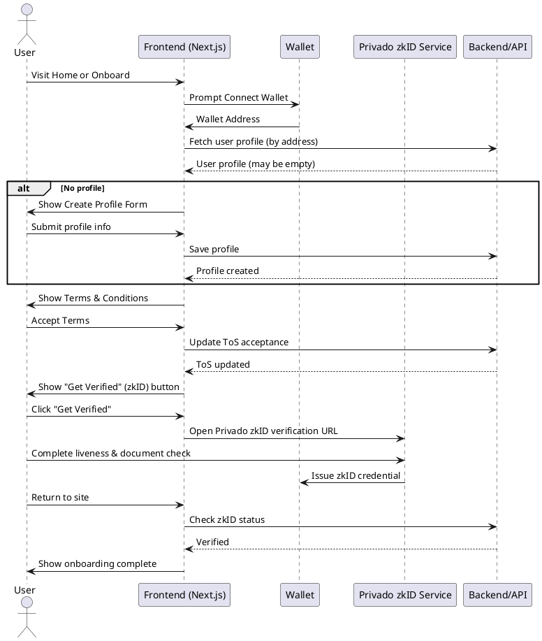
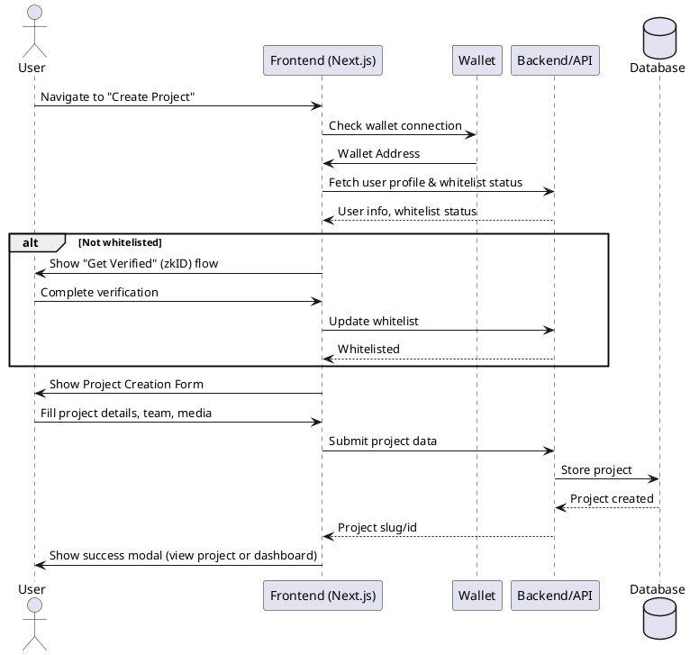
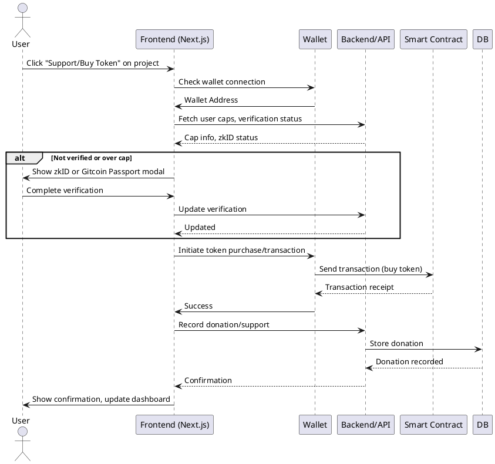
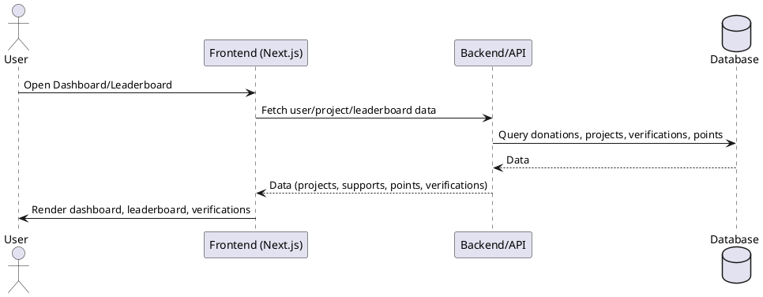

# Quadratic Acceleration (q/acc)

**Quadratic Acceleration (q/acc)** is a pioneering Web3 platform that redefines trust and transparency in token launches. By combining the best of Quadratic Funding (QF) and Augmented Bonding Curves (ABCs), q/acc provides a secure, transparent, and rug-proof environment for launching and supporting innovative Web3 projects.

## Table of Contents

- [Features](#features)
- [Tech Stack](#tech-stack)
- [Getting Started](#getting-started)
- [Project Structure](#project-structure)
- [Key Functionality](#key-functionality)
- [Identity & Compliance (zkID)](#identity--compliance-zkid)
- [Leaderboard](#leaderboard)
- [Contributing](#contributing)
- [License](#license)
- [Contact](#contact)
- [Developer Sequence Diagrams](#developer-sequence-diagrams)

---

## Features

- **Curated Token Launches:** Only the most promising Web3 startups are hand-picked to launch their tokens in a secure, transparent, and rug-proof way.
- **Quadratic Funding & Bonding Curves:** Innovative protocol design for fair and accelerated innovation.
- **Project Discovery:** Browse, filter, and support vetted projects.
- **User Dashboard:** Track your contributions, manage your projects, and view verifications.
- **Leaderboard:** See top supporters and project funders.
- **Zero-Knowledge Identity (zkID):** Privacy-preserving KYC for compliance and Sybil resistance.
- **Modern UI:** Built with Next.js, React, and Tailwind CSS for a seamless user experience.

---

## Tech Stack

- **Framework:** [Next.js 14](https://nextjs.org/)
- **Language:** TypeScript
- **UI:** React 18, Tailwind CSS
- **State/Data:** React Query, Wagmi, Ethers.js, Axios
- **Blockchain:** Ethereum-compatible, with wallet connection and on-chain interactions
- **Database:** MongoDB (for project and user data)
- **Other:** Zero-knowledge KYC via Privado, Google Analytics/Tag Manager

---

## Getting Started

### Prerequisites

- Node.js (18+ recommended)
- npm, yarn, pnpm, or bun

### Installation

1. **Clone the repository:**

   ```bash
   git clone https://github.com/your-org/q-acc.git
   cd q-acc
   ```

2. **Install dependencies:**

   ```bash
   npm install
   # or
   yarn install
   # or
   pnpm install
   # or
   bun install
   ```

3. **Run the development server:**

   ```bash
   npm run dev
   # or
   yarn dev
   # or
   pnpm dev
   # or
   bun dev
   ```

4. **Open your browser:**
   Visit [http://localhost:3000](http://localhost:3000)

---

## Project Structure

```
src/
  app/           # Next.js app directory (routing, pages, layouts)
  components/    # Reusable React components
  hooks/         # Custom React hooks
  services/      # API and data services
  queries/       # GraphQL queries
  types/         # TypeScript types/interfaces
  context/       # React context providers
  helpers/       # Utility/helper functions
  config/        # Configuration files
  public/        # Static assets (images, icons, etc.)
```

---

## Key Functionality

### Project Discovery

- **Browse Projects:** View all vetted projects, filter by season, and see project details.
- **Support Projects:** Connect your wallet and support projects using the platform's quadratic funding mechanism.

### User Dashboard

- **My Projects:** Manage and track your own projects.
- **Contributions:** View your funding history and supported projects.
- **Verifications:** See your KYC/zkID status and history.

### Leaderboard

- **Top Supporters:** See who has contributed the most, ranked by q/acc points and projects funded.
- **Sortable & Paginated:** Sort by points or projects funded, and navigate through pages.

---

## Identity & Compliance (zkID)

- **Zero-Knowledge KYC:** Uses Privado ID for privacy-preserving identity verification.
- **Liveness & Documentation Checks:** Ensures only real, eligible users can participate.
- **Credential Storage:** Your wallet holds a zkID credential, enabling participation without exposing personal data.
- **Sybil Resistance:** Protects against fake accounts and ensures fair participation.

---

## Styling & Customization

- **Tailwind CSS:** Utility-first CSS framework with custom theme extensions.
- **Custom Fonts & Colors:** See `tailwind.config.ts` for details.

---

## Scripts

- `dev` - Start the development server
- `build` - Build for production
- `start` - Start the production server
- `lint` - Run ESLint
- `lint:fix` - Fix lint errors
- `format` - Format code with Prettier

---

## Contributing

1. Fork the repository
2. Create your feature branch (`git checkout -b feature/YourFeature`)
3. Commit your changes (`git commit -am 'Add some feature'`)
4. Push to the branch (`git push origin feature/YourFeature`)
5. Open a pull request

---

## License

Distributed under the MIT License. See `LICENSE` for more information.

---

## Contact

- **Email:** info@qacc.xyz
- **Telegram Support:** [q/acc Support Telegram](https://t.me/your-support-link)
- **Website:** [https://qacc.xyz](https://qacc.xyz)

---

# Developer Sequence Diagrams

Below are key sequence diagrams for the main flows in this project. You can render these using [PlantUML](https://plantuml.com/sequence-diagram) or compatible tools.

## 1. User Onboarding & zkID Verification Flow



## 2. Project Creation Flow



## 3. Supporting a Project (Donation/Buy Token)



## 4. Dashboard & Leaderboard Data Flow


